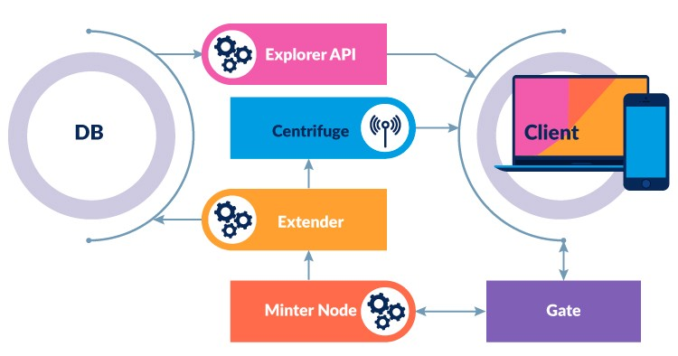

<p align="center" background="black"></p>


# Minter Explorer api

The official repository of Minter Explorer API service.

_NOTE: This project in active development stage so feel free to send us questions, issues, and wishes_

<p align="center" background="black"></p>

## API Docs
https://app.swaggerhub.com/apis-docs/GrKamil/minter-explorer_api

## Related services:
- [explorer-extender](https://github.com/MinterTeam/minter-explorer-extender)
- [explorer-gate](https://github.com/MinterTeam/explorer-gate)
- [explorer-validators](https://github.com/MinterTeam/minter-explorer-validators) - API for validators meta
- [explorer-tools](https://github.com/MinterTeam/minter-explorer-tools) - common packages
- [explorer-genesis-uploader](https://github.com/MinterTeam/explorer-genesis-uploader)

## BUILD

- dep ensure

- run `make build`

## USE

### Requirement

- PostgresSQL

- Centrifugo (WebSocket server) [GitHub](https://github.com/centrifugal/centrifugo)

- Explorer Extender [GitHub](https://github.com/MinterTeam/minter-explorer-extender)

### Setup

- be sure [explorer-extender](https://github.com/MinterTeam/minter-explorer-extender) has been installed and work correctly

- build and move the compiled file to the directory e.g. `/opt/minter/explorer`

- copy config.json.example to config.json file in extender's directory and fill with own values

#### Run

./explorer -config=/path/to/config.json

### Config file

Support JSON and YAML formats 

```{
     "name": "Minter Explorer Api",
     "debug": true,
     "baseCoin": "MNT",  -- MNT for testnet / BIP for mainnet
     "database": {
       "host": "localhost",
       "name": "explorer",
       "user": "minter",
       "password": "password",
       "poolSize": 20
     },
     "server": {
       "port": "8080"
     },
     "extender": {
       "ws": {
           "address": "wss://centrifugo.url/connection/websocket",
           "channel_blocks": "blocks"
       }
     },
     "bipdev": {
       "api": ""
     }
   }
```